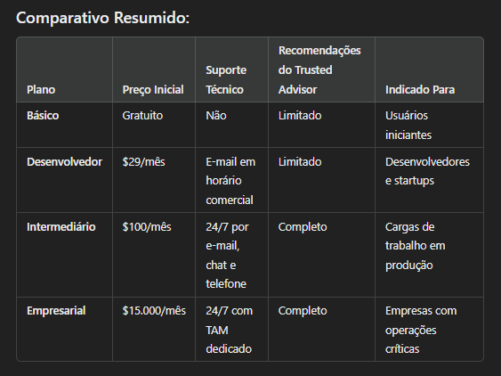

A AWS oferece quatro tipos principais de planos de suporte, cada um projetado para atender diferentes necessidades de clientes, desde usuários individuais até grandes empresas. Aqui está um resumo dos tipos de suporte da AWS:

### 1. Suporte Básico (Basic Support):
- Custo: Gratuito.
- Recursos Incluídos:
- Acesso ao AWS Trusted Advisor (funcionalidades limitadas).
- Documentação, whitepapers e fóruns de discussão.
- Suporte ao cliente para questões de cobrança.
- Indicado para: Usuários iniciantes ou projetos não críticos.

### 2. Suporte para Desenvolvedores (Developer Support):
- Custo: A partir de $29/mês ou 3% do uso mensal (o que for maior).
- Recursos Incluídos:
- Respostas técnicas por e-mail durante o horário comercial.
- Orientação para uso de serviços da AWS.
- Acesso ao Trusted Advisor (recomendações limitadas).
- Indicado para: Desenvolvedores e startups explorando a AWS.

### 3. Suporte Empresarial Intermediário (Business Support):
- Custo: A partir de $100/mês ou 10% do uso mensal (reduz conforme o gasto aumenta).
- Recursos Incluídos:
- Suporte 24/7 por telefone, chat e e-mail.
- Acesso completo ao Trusted Advisor.
- Tempo de resposta rápido (ex.: 1 hora para problemas de produção).
- Ferramentas avançadas como AWS Personal Health Dashboard.
- Indicado para: Empresas que executam cargas de trabalho em produção.

### 4. Suporte Empresarial (Enterprise Support):
- Custo: A partir de $15.000/mês ou uma porcentagem do uso mensal.
- Recursos Incluídos:
- Designação de um Technical Account Manager (TAM).
- Suporte prioritário 24/7 para todos os níveis de severidade.
- Revisões regulares de arquitetura e recomendações personalizadas.
- Acesso total ao Trusted Advisor e suporte para migrações e otimização.
- Indicado para: Grandes empresas com cargas de trabalho críticas e alta demanda de suporte.

[Menu](readme.md)